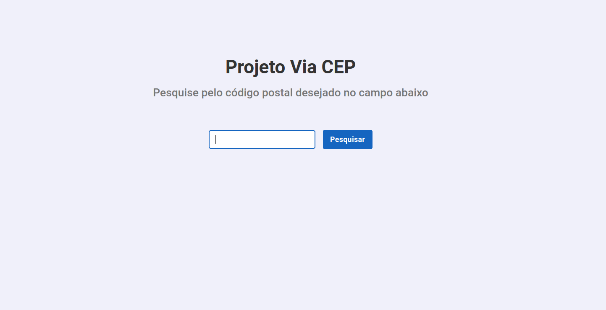

    

<h1 align="center">Projeto ViaCEP - Aplicação web</h1>

<h2 align="center">
    Aplicação web feita para auxiliar o usuário a buscar um CEP.
</h2>

 

    
    
    

 

    <a href="#goal">Objetivo</a> •
    <a href="#technologies">Tecnologias</a> •
    <a href="#features">Features</a> •
    <a href="#features">Instruções</a> •
    <a href="#author">Autor</a>

 

<h2 id="goal">🎯️ Objetivo</h2>

 

    O objetivo dessa aplicação web é auxiliar o usuário na busca pelo CEP e mostrar as informações de forma simples na tela.

 

<h2 id="features">💻️ Features</h2>

 

- [x] Busca pelo CEP

 

<h2 id="technologies">🛠 Tecnologias</h2>

 

As seguintes ferramentas foram usadas no desenvolvimento do projeto:

- [ReactJS](https://pt-br.reactjs.org/)
- [TypeScript](https://www.typescriptlang.org/)
- [Axios](https://axios-http.com/docs/intro)

 

<h2 id="features">🗒️ Instruções</h2>

 

<h3>Para rodar o projeto siga as instruções abaixo:</h3>

**1.** Clonar esse repositório em um local de sua preferência

**2.** Instalar as depedências do projeto com o **npm** (comando `npm install`) ou com **yarn** (comando `yarn`)

**3.** Subir o servidor backend. Será necessário realizar a configuração da API REST presente no repositório **https://github.com/lucas95santos/viacep-api** antes de subir essa aplicação.

**4.** Execute o comando `yarn start` ou `npm start` para subir a aplicação.

**5.** Pronto. A aplicação web estará disponível na url **http://localhost:3000**.

 

<h2 id="author">✏️️ Autor</h2>

 

<a>
    
     
    <strong>Lucas Santos</strong>
</a>

 

Get in touch!

